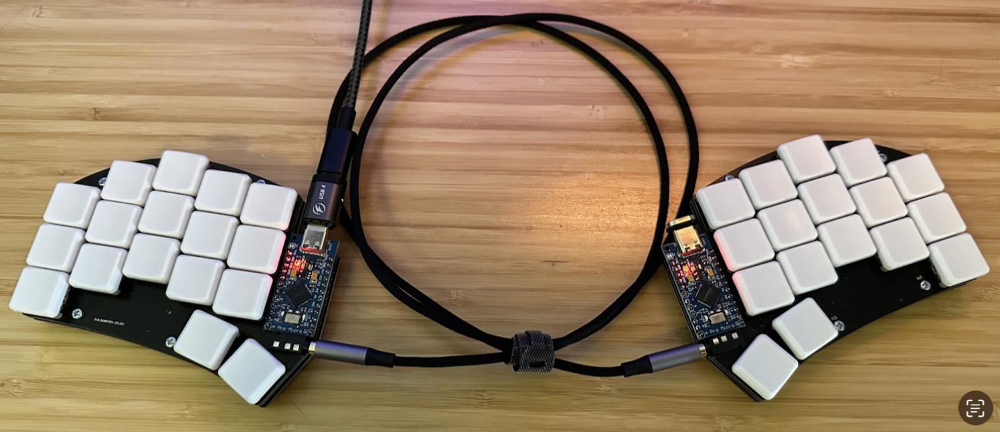
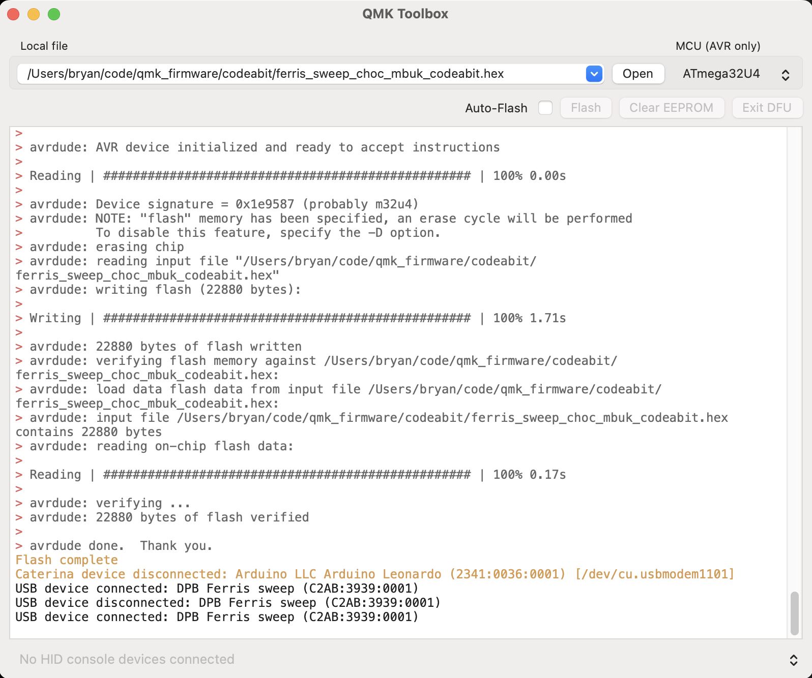

# Codeabit Ferris Sweep Keyboard Build

I use this repo to build customized QMK firmware for my ferris sweep keyboard.

My customizations are all on the `codeabit-ferris` branch. My repo is forked from `keyboard-magpie/qmk_firmware` because that's where I purchased my board and their board was designed with non-standard wiring so I can't directly fork from `qmk/qmk_firmware`.

To build the firmware, navigate into the `codeabit` folder an run `./build.sh`. Since I'm running on an Apple Silicon Mac, I launch a container running linux with the `qmk_firmware` folder mounted to do the actual build. It's bit slower doing the build on folder mounted from MacOS, but it has the advantage that I can just run the script and the `.hex` firmware is generated right in the `codeabit` folder. The build requires that docker is installed and running.

To install, I've been using QMK Toolbox. I installed the `qmk-toolbox` from homebrew. To program the keyboard, just connect the USB-C cable to the keyboard, momentarily hold down the outer corner keys on the keyboard to put it into flash mode, and then click the "Flash" button on the QMK Toolbox. Each side needs to be flashed separately.

# Quantum Mechanical Keyboard Firmware

This is a keyboard firmware based on the [tmk\_keyboard firmware](https://github.com/tmk/tmk_keyboard) with some useful features for Atmel AVR and ARM controllers, and more specifically, the [OLKB product line](https://olkb.com), the [ErgoDox EZ](https://ergodox-ez.com) keyboard, and the [Clueboard product line](https://clueboard.co).

## Documentation

* [See the official documentation on docs.qmk.fm](https://docs.qmk.fm)

The docs are powered by [Docsify](https://docsify.js.org/) and hosted on [GitHub](/docs/). They are also viewable offline; see [Previewing the Documentation](https://docs.qmk.fm/#/contributing?id=previewing-the-documentation) for more details.

You can request changes by making a fork and opening a [pull request](https://github.com/qmk/qmk_firmware/pulls), or by clicking the "Edit this page" link at the bottom of any page.

## Supported Keyboards

* [Planck](/keyboards/planck/)
* [Preonic](/keyboards/preonic/)
* [ErgoDox EZ](/keyboards/ergodox_ez/)
* [Clueboard](/keyboards/clueboard/)
* [Cluepad](/keyboards/clueboard/17/)
* [Atreus](/keyboards/atreus/)

The project also includes community support for [lots of other keyboards](/keyboards/).

## Maintainers

QMK is developed and maintained by Jack Humbert of OLKB with contributions from the community, and of course, [Hasu](https://github.com/tmk). The OLKB product firmwares are maintained by [Jack Humbert](https://github.com/jackhumbert), the Ergodox EZ by [ZSA Technology Labs](https://github.com/zsa), the Clueboard by [Zach White](https://github.com/skullydazed), and the Atreus by [Phil Hagelberg](https://github.com/technomancy).

## Official Website

[qmk.fm](https://qmk.fm) is the official website of QMK, where you can find links to this page, the documentation, and the keyboards supported by QMK.
